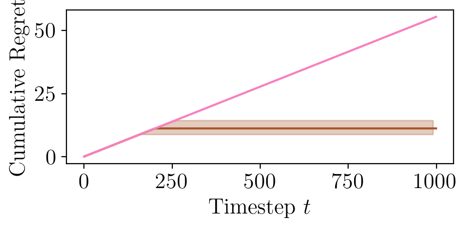
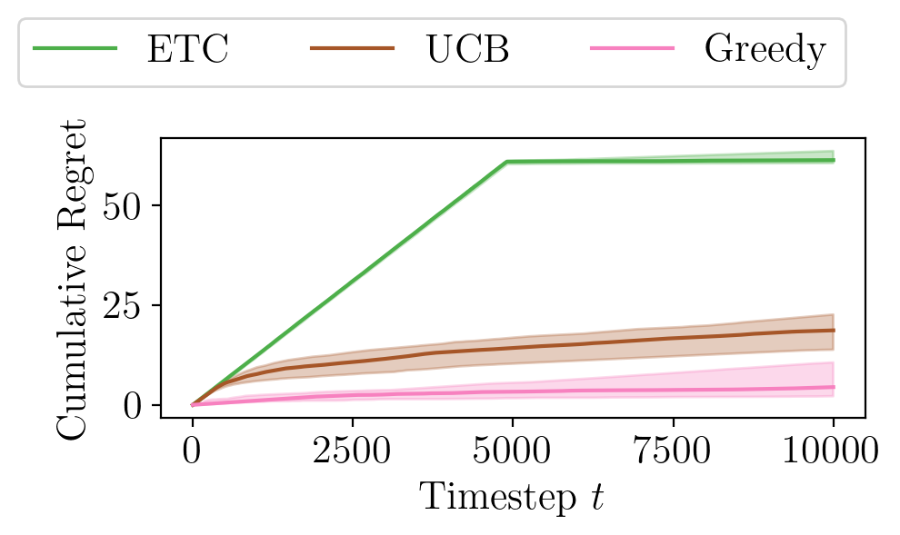

# mmab
Multiplayer multiarm bandits

## Install
All commands are to be run from the unzipped directory unless specified otherwise.

### Create virtual environment
``` python
conda create --name mmab pip
conda activate mmab
```

### Requirements
``` bash
pip install -r requirements.txt
```

For the core algorithm
* numpy

For plotting and running experiments
* matplotlib
* joblib

For running tests
* pytest

### Install MMAB
``` bash
pip install -e .
```

Run tests
``` bash
pytest
```


## Experiments

### Reproducing Figure 1: Benchmark of ETC, UCB and Cautious Greedy on synthetic data with $\nu^* = 0$ (left) and $\nu^* = 1$ (right) 

Move into the `experiments` directory and run the benchmark:

`python 0_players.py` (Data with $\nu^* = 0$, computation time: 22 seconds)

`python no_elimination.py` (Data with $\nu^* = 1$, computation time: 1 minute and 24 seconds) 

Move into the `plotting` directory and plot the data:

`python plot_experiments.py` (Computation time: 1 second )

Move into the `figure` directory to see the reproduced figure:






